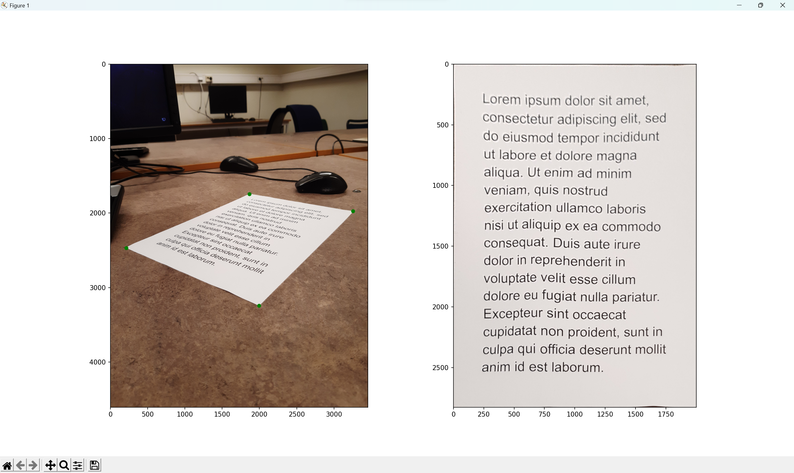

# Paper transformations

When a piece of paper is photographed at a weird angle, it becomes difficult for both humans and OCR programs to read the text on it. Given an image containing an A series piece of paper, possibly at a very awkward angle, the code in this repository identifies the paper in the image and then simulates what it would look like if one were to look at the paper from directly above it.

## How to run
To be able to run the program, you need Python with NumPy, Matplotlib and OpenCV. 

The main script is located in *src/main.py*. When you run it you can specify the path to an image containing a piece of paper, and the program will process it and show you a window like the one below. On the left is the image you chose, with the paper corners marked with green dots, and on the right is what the paper looks like from directly above. If the program is unable to find a paper in the image, it will tell you that.

## How it works
First, a highpass filter, dilation and erosion are used to find edges and separate different regions in the image. We use Otsu's binarization to determine which of the regions are bright (if a region is not bright then it is guaranteed not to be the paper we are looking for). Then we go through all the bright regions and see if their convex hull can be approximated by a quadrilateral. To see if a convex hull is close to being a quadrilateral, we find the 4 points of the hull which create a quadrilateral of maximal area. If this area is close to the area of the convex hull, then we pretty much by definition have determined that the convex hull is close to being a quadrilateral. And if this is the case for a bright region, then the quadrilateral is deemed to be the paper.

We calibrate with the standard OpenCV function *calibrateCamera*, using the pixels of the paper corners and the center of the paper as the 2D image points. We define the paper to have its top left corner at the origin in 3D space, and simply place the other corners and the center of the paper at the appropriate distances from the origin. These corners and the center are used as the 3D object points in the calibration. The calibration gives us information about the camera itself (i.e. lens etc.) and its position and orientation in 3D space, which is all you need to calculate which pixel in the camera any 3D point is projected to/seen by. 

Using the definition for the real paper we made earlier, we can simply create a bunch of points in a grid on its surface in 3D space, project them into the camera and note which pixels they land on. If all the paper detection and calibration has been done perfectly up until this point, then the projected points will all land on pixels that are covered by the paper in the image. For each projected point, we color its corresponding point in the grid with the color of the pixel that it landed on. Then the paper grid will be colored according to the paper in the image. If we save this colored grid in a simple NumPy ndarray we can just display it using e.g. Pyplot.